# A command palette the kit ships: the shell, the ranking, the keyboard — and no result kinds

Closes #274.

## Premises

**What this is about.** Artur asked for a command palette that comes from apliteni-ui with
documented guidelines rather than being built once per product. Two portal issues
(apliteni/finance.apli.tech#445 and #375) had already asked for one and closed without it.

**What I found in this repo.**

- There is no palette, and nothing close enough to stand in for one. `dropdown()` is a popover
  list with a trigger and no text box; `confirm()` and `drawer()` are the two overlays, and
  neither searches anything.
- What a palette actually needs was already here, unused by any search surface:
  `src/components/overlay.js` owns one stack per document — what is inert, which overlay Escape
  talks to, where Tab may go — and `returnFocus()` already handles an opener the command has
  deleted. A palette that invented its own Escape would be the third answer on a page that has
  one.
- The kit already names the two things a palette's look is made of: `--dur-med` / `--ease` for
  the surface, and `.ui-sr` (`src/styles/loading.css:17` `.ui-sr {`) for a live region nobody sees.
- The one thing that was missing and could not be borrowed is ranking. Nothing in the kit
  orders anything by a query.

**What I did.** Shipped `commandPalette()` as an HTML+CSS factory on that overlay stack, a React
`<CommandPalette>` that renders the same markup and imports the same ranking, a guidelines page,
and three gates. The kit ranks, groups and answers the keyboard; it names no result kinds.

**The verdict: Built.** The request was right and the open question has an answer the survey
supports.

## The survey

Nine systems, read from their own source or published guidance on **2026-09-11**, not from
memory. This sits in the pull request rather than in `docs/` because
[`docs/README.md`](docs/README.md#where-a-decision-gets-recorded) says the "why this shape and not
the other" belongs to the issue and the thread that produced it.

| System | What it ships | Who supplies results | Selection model | Ranking | Keyboard |
|---|---|---|---|---|---|
| **cmdk** (`cmdk/src/index.tsx`, `command-score.ts`) | Parts: `Dialog`, `Input`, `List`, `Group`, `Item`, `Separator`, `Empty`, `Loading` | The consumer, as children | `role=combobox` input + `role=listbox` / `role=option`, `aria-activedescendant` — **DOM focus never leaves the input** | `commandScore()` 0–1: `SCORE_CONTINUE_MATCH 1`, `SCORE_SPACE_WORD_JUMP 0.9`, `SCORE_NON_SPACE_WORD_JUMP 0.8`, `SCORE_CHARACTER_JUMP 0.17`, transposition 0.1; **groups ranked by their best member**; `keywords` concatenated onto the string | ↑↓, Home/End = first/last row, Alt+↑↓ by group, Meta+↑↓ ends, Ctrl+N/P/J/K (vim). **No Escape handling at all** |
| **kbar** (README) | `KBarProvider`, `KBarSearch`, `KBarResults`, `useMatches` | The consumer, as an **action shape**: `{ id, name, shortcut, keywords, section, perform, parent }` | Consumer renders rows via `onRender` | `useMatches()` returns one flattened array — `["Section", Action, Action, "Section", …]` | ⌘K/Ctrl+K built in, Ctrl+N/P |
| **GitHub** (docs.github.com, command palette page) | A product feature | GitHub | — | — | Ctrl+K / ⌘K, `>` switches to command mode, prefixes `#` issues/PRs/discussions/projects, `@` users/orgs/repos, `/` files, `!` projects; Esc closes; ⌘Enter new tab; ⌘C copy URL |
| **Primer** (primer.style/components, read 2026-09-11) | `ActionList`, `ActionMenu`, `Autocomplete` publicly — **`CommandPalette` is listed under Internal components**, with no public component page | — | — | — | — |
| **VS Code** (code.visualstudio.com/docs) | Two surfaces: Command Palette ⇧⌘P and Quick Open ⌘P | VS Code | — | — | Prefixes `>` commands, `@` symbols in file, `#` symbols globally, `?` help. Empty Quick Open shows **recently opened** |
| **Slack** (Quick Switcher help) | A product feature | Slack | — | — | ⌘K; `#` channels, `@` people; ↑↓ or Tab; Return opens |
| **Linear** (docs + changelog + linear.app/now) | A product feature | Linear | — | **Contextual**: "if you are looking at cycles… the command menu will first display commands that are related to cycles" | ⌘K; shortcuts shown beside actions, which the team describes as how people learn them |
| **Raycast** (developers.raycast.com, store guidance) | An extension platform | Extensions | — | — | Naming rules instead: `<verb> <noun>`, Title Case, no articles; **the subtitle is indexed for search**; `List.EmptyView` and "avoid a flickering empty state" |
| **W3C ARIA APG** (combobox pattern) | The normative pattern | — | "DOM focus remains on the combobox and the combobox has `aria-activedescendant` set to… the focused element within the popup"; `aria-autocomplete="list"`, `aria-controls`, `aria-expanded`, `aria-selected` on the option | — | Escape "closes the popup and returns focus to the combobox"; ↑↓ move and select; Enter accepts. **Home/End belong to the text caret** |

### What the survey actually settles

**Nobody's design system ships a public palette; the libraries ship a shell.** Primer — the
design system of the product with the best-known command palette — keeps `CommandPalette`
internal. cmdk and kbar are the two that ship, and both are shells: cmdk takes children, kbar
takes an `action` shape with a free-text `section`. Neither names an issue, a file or a user.

**Result *kinds* live in the product, and they surface as prefixes.** GitHub's `#`, `@`, `/`,
`!`, `>`; VS Code's `>`, `@`, `#`, `?`; Slack's `#` and `@`. Every one of those sets is that
product's vocabulary. A kit that enumerated kinds would need a release before the finance portal
could add "payout".

**Everyone agrees on the accessibility model and it is not a menu.** cmdk implements exactly the
APG combobox: the input keeps DOM focus, rows are options, the active row is named by
`aria-activedescendant`. That is the only model where arrows can move a selection while letters
keep arriving.

**They disagree about how many keys to take.** cmdk binds Home/End to the first and last row,
plus Alt+Arrow, Meta+Arrow and four vim bindings — a second keyboard with no documentation
anywhere in its README. APG says Home and End are the caret's. The kit takes APG's answer.

## The decision the issue asked for

> *Does the kit supply the shell and leave each product to feed it results, or does it define
> result kinds too?*

**Chosen: the shell, the ranking and the keyboard — plus the three ways a row can *behave*.
Rejected: a closed set of result kinds.**

Kinds are the product's words. What is not the product's is what Enter does, and there the kit
found three cases that are genuinely different, so the item shape names them:

| The row | How it is written | What Enter does |
|---|---|---|
| goes somewhere | `href` | closes the palette and navigates; ⌘/Ctrl+Enter opens a tab |
| runs something | anything with an `id` | reports `ui-command` and closes |
| destroys something | `danger` + `confirm` (React: `onConfirm`) | opens the kit's `confirm()` **above** the palette and leaves it standing |

A `danger` row that names no confirm is rendered `aria-disabled` rather than run. That is the
one opinion the kit imposes on content, and it is the destructive-actions guideline applied to
the fastest surface in a product — the one where a reader is looking at the text box while the
list reorders underneath them.

The seam for a product that ranks its own results is `rank: false`: the palette reports what was
typed as `ui-command-query` and renders what it is handed, in the order it is handed it.
`scoreCommand`, `rankCommands` and `rankGroups` are exported so a server sorts the same way
rather than differently.

**The ranking is a ladder, not a score.** Exact label 100 → prefix 90 → word start 80 →
substring 70 → keyword 60 → description 40 → initials 20, ties broken by the caller's order,
groups carried by their best row. cmdk's continuous score ranks better and cannot be explained
to somebody who asks why their row is third; the kit's palettes hold tens of rows, not
thousands. With nothing typed every score is equal, so the list is exactly what the caller
passed — which is where a product puts the four things people actually do here. The kit
remembers nothing between openings: a palette that should show recents is one that was handed a
recents group.

## The variants, and the default Artur chose

One markup, one stylesheet, one modifier class. Both ship; the question was only which one
`commandPalette()` draws when nobody asks.

**Light**

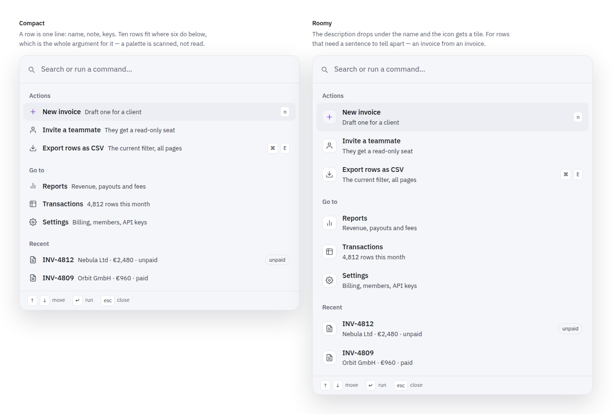

**Dark**

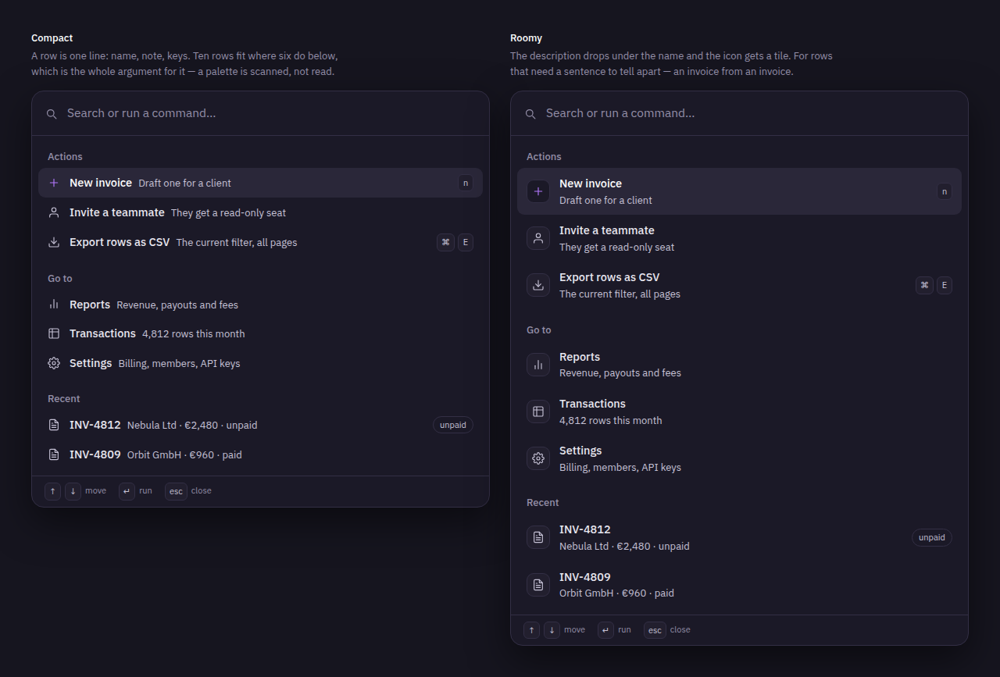

- **Compact** — a row is one line: icon, name, note, shortcut keys. Ten rows fit where six do.
- **Roomy** (`density: 'roomy'`) — the note drops under the name and the icon gets a tile, for
  rows that need a sentence to tell apart: an invoice from an invoice.

## Decision record for the issues

For #274, to be written into the thread when it closes:

- **Chosen: the kit ships the shell, the ranking, the keyboard and the three row behaviours.**
  Rejected: defining result kinds in the kit. Reason: every surveyed system that ships a palette
  ships a shell (cmdk, kbar), the one design system that has a palette keeps it internal
  (Primer), and every product's kinds surface as its own prefix vocabulary. Derived from the
  survey above rather than chosen by preference.
- **Chosen: Compact as the default density.** Rejected: Roomy as the default — 40% fewer rows per
  screen, and a palette is scanned rather than read. Roomy ships as the modifier. **Chosen by
  Artur on 2026-09-11**, from the rendered variants above.
- **Chosen: a `danger` row without a confirm renders disabled.** Rejected: rendering it live and
  trusting the caller. Reason: the palette reorders under the reader between keystrokes.
- **Chosen: APG's key set.** Rejected: cmdk's Home/End, Alt+Arrow, Meta+Arrow and vim bindings —
  Home and End are the caret's, and the rest is a keyboard nobody documents.

## What is in the change

**The kit**

- `src/components/command-palette.js` — the factory, the ranking and the wiring. Escape,
  inertness and the Tab trap come from `src/components/overlay.js`, which gained one entry
  (`OVERLAY_LAYER.palette`) and learned that `data-cmdk` is an overlay root.
- `src/styles/command-palette.css` — one sheet, two densities, tokens only. It answers the same
  questions the drawer and the confirm sheets do, and `stories/overlay-css.test.js` now asks
  them of all three.
- `src/index.js`, `src/index.css`, `src/inline.js` — registered in all three manifests.

**React**

- `react/src/CommandPalette.tsx` — the same `.ui-cmdk` markup, and `rankGroups` imported from the
  kit rather than reimplemented, so a server render and a keystroke cannot disagree about what
  comes first. It reuses `Modal.tsx`'s `tabbablesIn` / `dismissOnScrim` instead of carrying a
  third copy (see **Merge order** below).
- Two deliberate differences from the vanilla one, both because a React host owns the state the
  wiring would: no ⌘K binding (`open` is the host's prop), and a destructive row names an
  `onConfirm` callback rather than a confirm's id.
- A third that is not deliberate and is going: one Escape closes a `Modal` and the palette under
  it, because each registers its own document listener and `inert` does not stop one. The
  vanilla pair does not, being on one stack. It goes when the palette joins the shared dialog
  stack, which is the rebase onto #289 (see **Merge order** below).

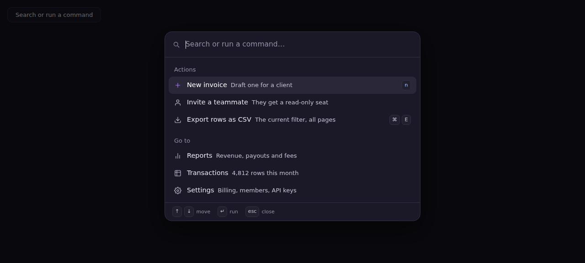
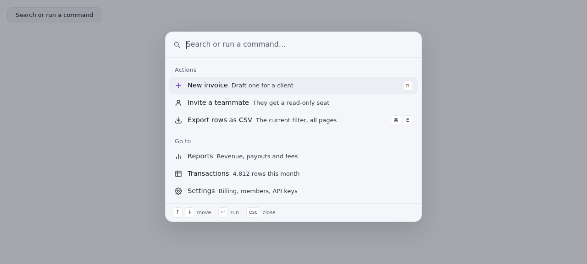

The React side makes the same refusal — a destructive row with an `onConfirm` beside one
without:

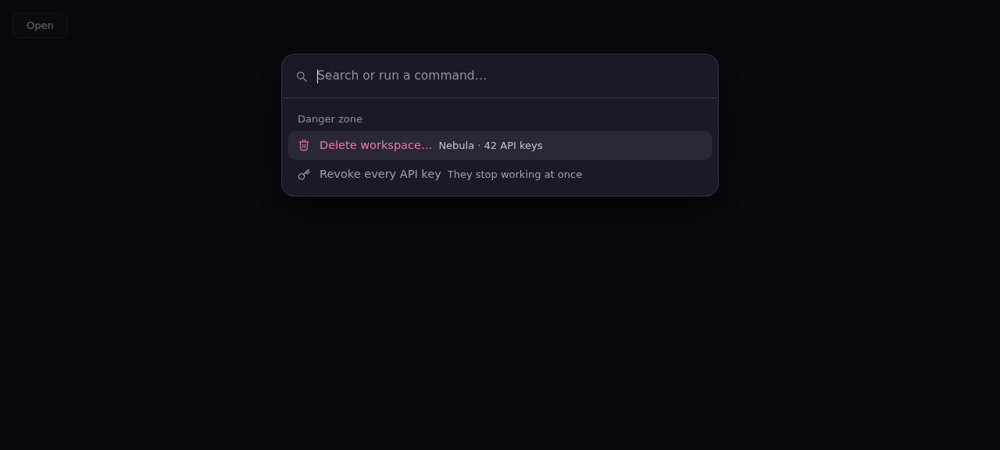

**Guidelines** — `Guidelines/The command palette`, six rules, each with a specimen pair or a
reason, and each pointing at kit code:

1. Put a thing in the palette only when a reader can name it.
2. Group results by what they are, and name each group in the product's own word.
3. Rank on how the query meets the name, and let the caller break every tie.
4. Answer six keys, and leave every other key to the text box.
5. Open focus in the text box, say how many results there are, and hand focus back.
6. Never let the palette run a delete on its own.

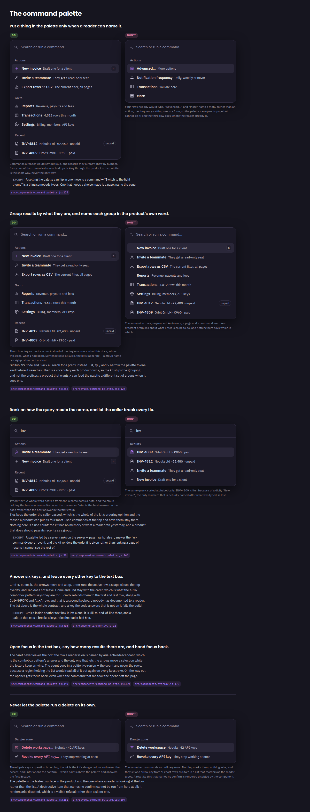
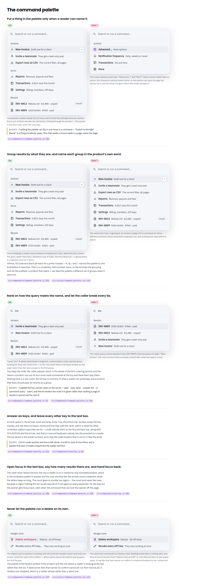

**States** — ranked, nothing matching, and the destructive pair:

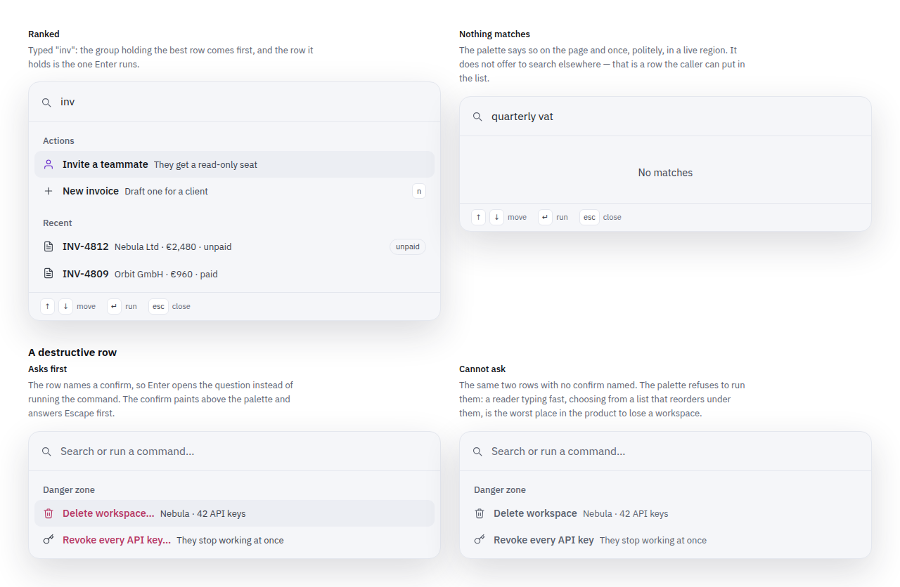
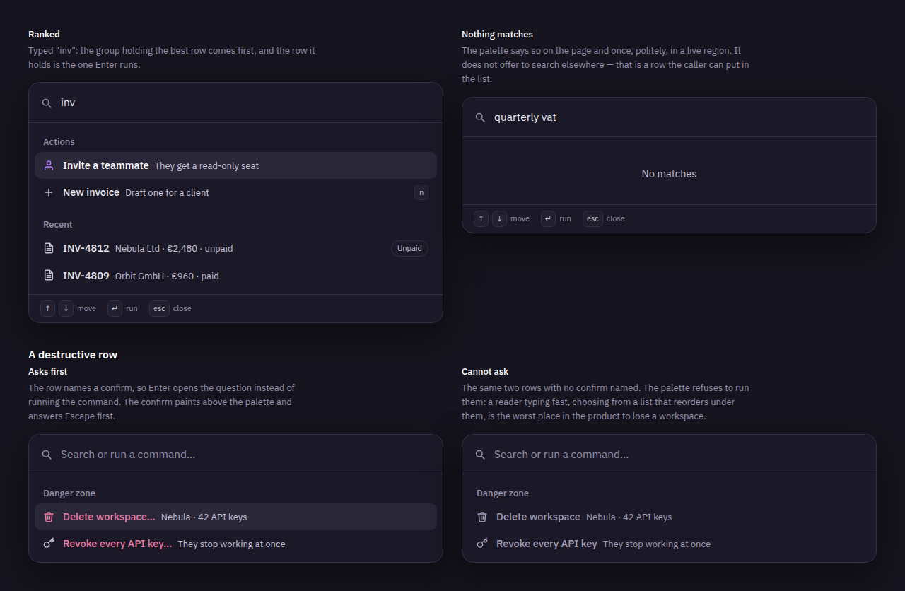

**The real thing over a real page**, opened from a control, scrim and all:

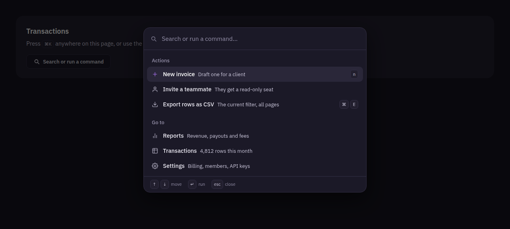
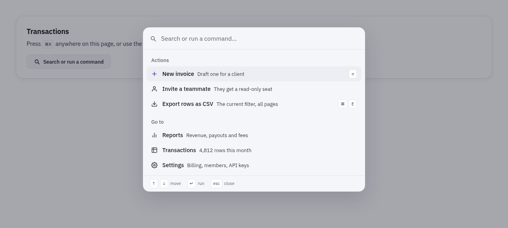

## Accessibility, and the gates behind it

The palette is the APG combobox inside a dialog: `role="combobox"` with `aria-autocomplete="list"`,
`aria-expanded`, `aria-controls`; a `role="listbox"` of `role="option"` rows, each with
`tabindex="-1"` so forty of them never land in the page's tab order; the active row named by
`aria-activedescendant` and marked `aria-selected`. DOM focus opens in the text box and stays
there. The page behind is `inert`. Escape closes the top overlay only — the confirm a row opened
before the palette under it — and focus goes back to the opener, or to the page when the command
took the opener with it. The count is announced politely in a `.ui-sr` live region, as a count
and never as the rows.

Four gates, three of them new. Every rule on the guidelines page has one:

| Gate | What it holds | New? |
|---|---|---|
| `stories/palette-keyboard.test.js` | Presses real keys: ⌘K opens (and Ctrl+K inside a text box does not), the arrows move and wrap and skip a disabled row, typing moves the active row to the best answer, Enter runs it, Escape closes with a query typed and returns focus, Tab does not leave, the page behind is inert and is handed back, and the confirm a row opened answers the first Escape. 14 tests | new |
| `stories/guidelines/command-palette.test.js` | The page against the component: every key the sources compare against is on the page and every key the page promises is answered; the label role the grouping rule claims, read off the sheet; and every palette row **any** story renders — a row must go somewhere, run something, ask something or say it is unavailable, and a destructive one must ask or be disabled. 7 tests | new |
| `src/components/command-palette.test.js` | The markup, the three behaviours, and the ranking asserted as **order** rather than as numbers. 27 tests | new |
| `react/src/CommandPalette.test.tsx` | The React palette compared to the vanilla factory shape by shape, then driven by keys. 13 tests | new |
| `stories/overlay-css.test.js` | The palette sheet now answers the same five questions the drawer and confirm sheets do, plus: a confirm paints above a palette | extended |
| `stories/danger-colour.test.js` | Extended with one named state class: the palette moves its active row with the arrow keys, so the state a pointer would put on it arrives from the keyboard and is a class rather than `:hover`. The entry carries its reason and the gate fails if no rule writes it | extended |
| `stories/guidelines/_accessibility-floor.js` | The floor page names all three new gates and what each cannot see — its own gate fails the build otherwise | extended |

Two failures the gates caught on this branch, both fixed rather than ledgered:

- **The disabled row did not repaint.** `--disabled-ink` *is* `--muted` and `--disabled-surface`
  *is* `--surface-2`, which is the palette's own panel — so a disabled row was pixel-identical to
  an enabled one and the floor gate said so. It takes `--disabled-ink-bare` now, the ink for a
  control with no box of its own, and the row's note moved from `--muted` to `--dim`.
- **The glyphs were under the line.** The row and search icons took the `icons.js` default 1.7 in
  a 24 box at 16 and 17px, painting 1.13 and 1.20 CSS px against the kit's 1.5. The sheet states
  a stroke-width now, the same arithmetic as `.ui-dropdown__ic`.
- **The destructive row shouted before anybody pointed at it.** `--pink` at rest is the danger
  signal spent on a row the reader is scrolling past. It is `--muted` at rest now and `--pink` on
  `:hover` and on the active row — and a destructive row the palette refuses to run drops
  `is-danger` altogether, because a row nothing can press is unavailable rather than dangerous.
- **A palette row is writable as a `<button>`.** The kit renders it as a `<div role="option">`,
  so nobody had seen it as one; it now cancels the four things a browser paints on a button.

## Verification

Run on this branch. **This machine is an 8-core box shared with other agents — `uptime` reported
a load average of 29.95 while these ran** — which matters for exactly one assertion, below.

```
$ npm test
ℹ tests 1190
ℹ pass 1187
ℹ fail 1
ℹ skipped 2
```

The two skips are the kit's own opt-ins, on `main` as well as here: the eight-cell
theme x accent contrast matrix behind `CONTRAST_ACCENTS=1`, and `the built Storybook publishes the ids the index
links`, which needs a `storybook-static/index.json` this run did not build.

The one failure is `stories/contrast.test.js` → *the walk has not run away with the clock*, a
120s wall-clock ceiling calibrated on a 10-core laptop against a 47.6s contended worst case. It
is **not this branch**, and it is measured rather than asserted:

| Run | Walk |
|---|---|
| this branch, `contrast.test.js` alone | **123.0s**; **156.6s** inside `npm test` |
| unmodified `origin/main` in a scratch worktree on this box, alone | **320.9s**, then **140.5s** |

`origin/main` fails the same assertion on this machine, by more. Every other gate is green,
including the two that would catch a real regression in that file — the miss-rate ratio and the
DOM-write counter, which are arithmetic rather than weather. CI runs on a machine nobody else is
using; if it fails there, the ceiling is a real finding and not mine.

```
$ npm run build
ESM dist/index.js  31.83 KB
ESM dist/index.css 1.55 KB
ESM ⚡️ Build success in 159ms
DTS ⚡️ Build success in 5218ms
DTS dist/index.d.ts 7.37 KB
```

```
$ cd react && npx vitest run
 Test Files  14 passed (14)
      Tests  238 passed (238)
```

Four more gates went red on the way and were fixed rather than ledgered, each one a real defect
in this branch: the disabled row that did not repaint, the glyphs under 1.5 CSS px, a `640px`
media query that is not one of the kit's three breakpoint steps, and a destructive row shouting
`--pink` before anybody pointed at it. The counts they key on moved with them —
`icon-size.test.js` 58 → 62, `typeface-roles.test.js` 41 → 45, and `.ui-cmdk__item` is now pinned
by name in `button-chrome.test.js` as a clickable row the kit never renders as a `<button>`.

## Changelog entry

Not written into `docs/changelog.md` and no version bumped — several PRs are in flight and the
coordinator sequences versions at merge. The lines I would write:

```
### Added
- **Command palette** — `commandPalette()` + `wireCommandPalette()`, and `<CommandPalette>` in
  React. ⌘K/Ctrl+K over a scrim: a text box, grouped results, ranking with the caller's order as
  the tie-break, and the ARIA combobox keyboard. The kit ships the shell and names no result
  kinds; a row goes somewhere, runs something, or asks a confirm first — and a destructive row
  with nothing to ask cannot be run. `rank: false` hands the query back for a palette a server
  feeds. Two densities, compact by default. (#274)
- **Guidelines/The command palette** — six rules: what belongs in it, how results are grouped and
  ranked, the six-key contract, focus and announcement, and the refusal to run a delete on its
  own. (#274)
```

## Merge order — this one goes last, after the drawer

Wave order: **#286 → #288 → #292 → #289 → #293**. Last, because the React half has to sit on
`react/src/dialog.ts`, which #289 introduces, and because two of the gates that hold this
branch's sheet are gates #289 brings with it. Against #286/#288/#292 alone it conflicts only on
`.storybook/preview.js`.

The two gates are already answered here rather than at the merge:
`src/styles/command-palette.css` carries its own `@media (prefers-reduced-motion: reduce) {
.ui-cmdk.is-open * { transition: none !important; } }` — without it the text box the palette
focuses on open is still hidden in that frame and focus falls to `<body>` — and
`.ui-cmdk__item[hidden]` carries the `motion: still` note `stories/motion-coverage.test.js`
reads. Nothing to do at the conflict for either.

**Nine conflicts, and what each one takes:**

| File | Conflict | Resolution |
|---|---|---|
| `PR.md` | whole file | take this branch's (scratch file) |
| `.storybook/preview.js` | both `storySort` lists, and the wiring line — #286 replaced `wireNav(wrap)` with `wireShell(wrap)`, this branch adds `wireCommandPalette(wrap)` to the old one | union both lists (*The command palette* into Guidelines, *Command palette* into Components); wiring line = `wireTopbar; wireShell; wireDrawer; wireConfirm; wireCommandPalette; initTabs` |
| `react/src/Modal.tsx` | #289 moved `tabbable` / `tabbablesIn` / `dismissOnScrim` into `dialog.ts`; this branch exported them from `Modal.tsx` | take **#289's** file, then the two lines below |
| `react/src/index.ts` | `Drawer` exports vs `CommandPalette` exports | union |
| `react/src/apliteni-ui.d.ts` | `statBand` / `drawer` vs the palette's five declarations | union |
| `react/README.md` | the component list | union → `DataTable, Pagination, StatBand, Modal, Drawer, CommandPalette, Button, Badge, Card, Icon`, keep this branch's paragraph |
| `stories/guidelines/_overview.js` | three hunks (content import, story import, `ENTRIES`) | union all three |
| `src/styles/icon-size.test.js` | comment only — **both sides say `62`**, so the constant merges silently and is then wrong by four | **66**, keeping both ledger sentences |
| `src/styles/typeface-roles.test.js` | 44 vs 45 | **48**, keeping all four justifications |

**The two React lines**, without which 27 React tests fail with
`TypeError: dismissOnScrim is not a function`: an `export` in front of `tabbablesIn` in #289's
`react/src/dialog.ts`, where it is a bare `const`, and
`react/src/CommandPalette.tsx:4` `import { tabbablesIn, dismissOnScrim } from './Modal'`
repointed to `./dialog`. Putting the palette on `useDialog` — the shared dialog stack — belongs
in the same commit: it is what stops one Escape closing a React `Modal` and the palette under
it, which `react/README.md` names as the third difference from the vanilla one.

**One digit nothing warns you about:** `reachable()` has moved twice on this branch and now sits
at `src/components/overlay.js:37` `function reachable(el)`. The comment at the top of #289's
`react/src/dialog.ts` still cites the line it had on `main`; repoint it, or
`scripts/code-refs.test.js` fails on the stale one. This branch's own citation of the same
function, in `react/src/Modal.tsx`, is already right.

## What I deliberately left out

- **Prefix modes** (`>`, `#`, `@`). The survey says the vocabulary is the product's, so the kit
  ships grouping and the `rank: false` seam instead. A product that wants `>` feeds a different
  set of groups when it sees one.
- **Nested pages** (cmdk's Backspace-goes-back). No surface here has asked for a palette two
  levels deep, and it is the feature that makes Escape ambiguous.
- **Any memory of what a reader ran before.** Recents are a group a product passes; the kit
  stores nothing.
- **Virtualised lists.** The list scrolls and the active row is kept in view. A palette holding
  thousands of rows should be ranking on a server, which is what `rank: false` is for.
- **The portal side.** This is the kit's half of #274 only; adopting it in
  `finance.apli.tech` is that repo's issue.

🤖 Generated with [Claude Code](https://claude.com/claude-code)

https://claude.ai/code/session_01KTCn7UC3huEKwrKZke9r2K
